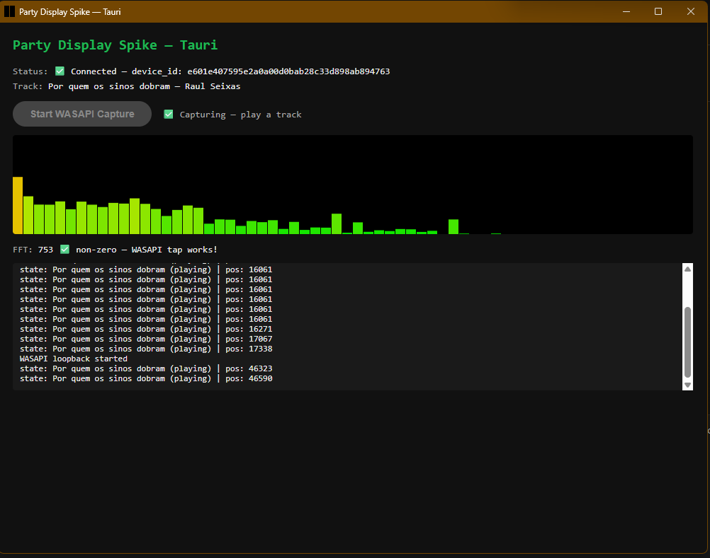

# Party Display

> A vibe coding exercise — building a real Spotify-connected party display, driven entirely by AI agents.

---

## What is this?

Party Display is a desktop application that registers as a **Spotify Connect device** and shows a fullscreen photo slideshow on a projector or TV, synchronized to the music playing. Think of it as a smart jukebox backdrop — your photos, your playlist, your party.

The app is being built on **Tauri v2** (Windows), using the **Spotify Web Playback SDK** for device registration and audio, **WASAPI loopback** (via Rust) for real-time spectrum visualization, and the **Spotify Audio Analysis API** for beat-synchronized photo transitions.

---

## This is a vibe coding exercise

This project is an experiment in **agentic software development** applied to a non-trivial problem. The goal is not just to build the app — it's to explore how far AI agents can go when the problem involves:

- External service integrations (Spotify OAuth, Web Playback SDK, Widevine DRM)
- System-level concerns (audio capture, native desktop runtime)
- Real unknowns that require investigation, not just code generation

Every spike, plan, and implementation task in this repo was driven by **Claude Code** and its agent ecosystem. The human role was product direction, validation, and unblocking — not writing code.

---

## Agents involved

| Agent | Role |
|---|---|
| **Claude Code** (main session) | Architect, debugger, coordinator — ran the entire project loop |
| **Implementer subagents** | Executed individual implementation tasks in isolated context windows |
| **Spec reviewer subagents** | Verified each task matched the plan before proceeding |
| **Code quality reviewer subagents** | Reviewed implementation quality after spec compliance |
| **Explore subagents** | Searched the codebase and gathered evidence during debugging |

The agent workflow followed the **superpowers skill suite** — `writing-plans` to design tasks, `subagent-driven-development` to execute them with two-stage review, and `systematic-debugging` to avoid guessing when things broke.

---

## The spikes

Before writing a single line of production code, three validation spikes were run to answer hard questions about the tech stack.

### Spike 1 — Electron + castlabs Widevine (`spike/` — first attempt)

**Question:** Can the Spotify Web Playback SDK run inside Electron?

**Findings:**
- Device registration worked
- Audio played — but every track failed with a `playback_error` at ~1 second, then auto-skipped
- Root cause: the castlabs Electron Widevine CDM was rejected by Spotify's license server at the DRM renewal boundary
- The Web Audio FFT tap also failed — the SDK sandboxes audio inside a **cross-origin iframe**, making `AudioContext` access impossible from the parent page

**Decision:** Drop Electron.

---

### Spike 2 — Browser (Node.js HTTPS + Chrome) (`spike/`)

**Question:** Does the SDK work properly in a real browser?

**Findings:**
- Playback was flawless — zero skipping, no DRM errors (Chrome's native Widevine is fully compatible)
- Confirmed the cross-origin iframe limitation: Chrome's Web Audio Inspector showed **"No Web Audio API usage detected"** while music played
- OAuth PKCE redirect to `https://localhost` was blocked by Spotify ("redirect_uri: Insecure") — a known Spotify quirk around loopback URIs

**Decision:** Browser runtime is valid, but needs a desktop wrapper for OAuth and the audio tap problem needs a different solution.

---

### Spike 3 — Tauri v2 (`spike-tauri/`) ✅

**Question:** Does Tauri's WebView2 satisfy Spotify's Widevine DRM? Can Rust capture system audio via WASAPI loopback?

**Findings:**
- **WebView2 + Widevine:** Device registered instantly, music played with zero skipping. WebView2 (Edge's Chromium engine) ships a native, fully compatible Widevine CDM.
- **WASAPI loopback:** `cpal 0.15` + `rustfft 6` successfully captured system audio output, ran FFT, and streamed 64 frequency bins to the frontend via Tauri events. FFT sum: **753 non-zero** on first run.
- Live spectrum canvas animated in real time while Spotify played.

**Decision:** Tauri v2 on Windows is the confirmed foundation.



*Live capture: Spotify SDK connected, WASAPI loopback active, spectrum canvas animating — FFT sum 753 non-zero on first run.*

---

## Architecture (Phase 2)

```
┌─────────────────────────────────────────┐
│              Tauri v2 App               │
│                                         │
│  ┌──────────────┐  ┌──────────────────┐ │
│  │ Control Panel│  │  Display Window  │ │
│  │  (WebView2)  │  │   (WebView2)     │ │
│  │              │  │                  │ │
│  │ Spotify SDK  │  │ Photo Slideshow  │ │
│  │ OAuth / Auth │  │ Now Playing HUD  │ │
│  │ Volume / Skip│  │ Spectrum Canvas  │ │
│  └──────┬───────┘  └────────┬─────────┘ │
│         │                   │           │
│  ┌──────▼───────────────────▼─────────┐ │
│  │           Rust Backend             │ │
│  │                                    │ │
│  │  WASAPI loopback → FFT → events    │ │
│  │  Spotify Audio Analysis API        │ │
│  │  OAuth PKCE + token refresh        │ │
│  │  Slideshow engine (folder watch)   │ │
│  │  IPC channels (typed)              │ │
│  └────────────────────────────────────┘ │
└─────────────────────────────────────────┘
```

**Tech stack:** Tauri 2 · Rust · React · TypeScript · Vite · cpal · rustfft · Spotify Web Playback SDK · Spotify Web API · LRCLIB · Open-Meteo · ipapi.co

---

## Project structure

```
vcup2/
├── spike/              # Spike 2: browser validation (Node.js + Chrome)
├── spike-tauri/        # Spike 3: Tauri v2 validation ✅ (confirmed stack)
├── docs/
│   └── superpowers/
│       └── plans/      # Agent-generated implementation plans
└── README.md
```

---

## Status

- [x] Spike 1 — Electron (abandoned)
- [x] Spike 2 — Browser (validated SDK + found FFT limitation)
- [x] Spike 3 — Tauri v2 (validated full stack) ✅
- [x] Phase 2 — Full app implementation (**v0.5 Beta**)

---

## v0.5 Beta — Current state

The app is functional and in daily use. All core features are implemented. Below is a full feature inventory as of this release.

### Spotify integration

- Registers as a **Spotify Connect device** via the Web Playback SDK running inside WebView2
- Full **OAuth PKCE** flow — browser opens for auth, redirect is caught by a single-instance deep-link handler, tokens stored in the Windows credential store (keyring)
- Automatic **token refresh** — sessions survive app restarts without re-auth
- **Now playing** card: album art, track name, artist, progress bar with seek
- Transport controls: play/pause, previous, next
- **Volume** slider with live feedback; volume changes emitted to the display window as toast notifications

### Photo slideshow

- Folder picker — watches a local folder for images (JPEG/PNG/WebP/GIF)
- Optional **recursive subfolder** scan
- **Play order**: alphabetical (with resume-from-last across restarts) or shuffle
- Configurable **fixed display time** per photo (seconds)
- **8 transition effects**: fade, slide left/right/up/down, zoom in/out, blur — plus a **random** mode that picks a different effect each advance
- Configurable **transition duration**
- **Image fit**: fill (cover/crop) or letterbox (contain)
- **Keyboard hotkeys** on the display window: `→`/`←` next/prev, `Space` pause/resume, `F` fullscreen, `S` spectrum, `T` track overlay, `B` battery

### Display window

- Runs in a separate window — intended for a second monitor, projector or TV
- **Fullscreen** toggle via double-click or Escape to exit
- Window position and fullscreen state **persisted** across restarts
- Position **validated against available monitors** on restore — repositioned to primary if the saved monitor is gone
- **Screensaver / sleep blocked** via `SetThreadExecutionState` while the display window is open
- Close button in control panel stays in sync even if the user closes the display window manually

### Spectrum analyser overlay

- Real-time **WASAPI loopback** audio capture (Rust — no driver install needed)
- **64-bin FFT** with logarithmic frequency mapping (40 Hz – 16 kHz) — eliminates the empty high-frequency bins that linear mapping produces
- Exponential smoothing with **fast attack / slow decay** for a polished, flicker-free look
- Two render styles: **bars** or **lines** (filled gradient area + stroke)
- Six colour themes: Energy (green→red), Cyan, Fire, White, Rainbow, Purple
- Configurable **height** as % of screen (default 10%) — true overlay, photo uses full screen underneath
- Toggled with the `S` hotkey
- A small **audio indicator** strip is also shown in the control panel Music card

### Track overlay

- Optional **"artist — title" overlay** on the display window, toggled with `T`
- Configurable: font family, font size, corner position (top/bottom × left/right), text colour, background colour, background opacity
- Artist name shown smaller above the track title

### Battery widget

- SVG battery icon in the top-right corner of the display window
- **5-step colour scale**: green → yellow-green → yellow → orange → red
- Lightning bolt overlay when charging; plug icon on desktops with no battery
- Configurable size; can be disabled

### Song & volume toasts

- **Song changed toast**: album art + track name slides in when the track changes, auto-dismisses
- **Volume changed toast**: compact level indicator on volume change
- Configurable display duration and scale

### Control panel

- Card-based layout with sticky header and vertical scroll
- **Cards**: Music, Slideshow, Display Window, Display Settings (collapsible)
- All display settings live-synced to the display window without restart

### Help panel

- `?` button in the header opens a modal with: app description, GitHub link, hotkeys reference table
- **Reset button**: clears all `localStorage` settings + Spotify credentials from the credential store, then relaunches the app — useful for diagnosing unknown issues

### App icon

- Custom icon: gold treble clef on a dark purple/navy gradient canvas with a gold painting frame and colourful paint-splash accents
- All platform sizes generated (Windows ICO, macOS ICNS, iOS, Android)

---

## Hotkeys (display window)

| Key | Action |
|---|---|
| `→` / `←` | Next / previous photo |
| `Space` | Pause / resume slideshow |
| `F` | Toggle fullscreen |
| `S` | Toggle spectrum analyser |
| `T` | Toggle track overlay |
| `B` | Toggle battery icon |
| `P` | Toggle photo counter |
| `C` | Toggle clock & weather |
| `L` | Toggle lyrics |
| `Esc` | Exit fullscreen |
| Double-click | Toggle fullscreen |

---

## Credits & open-source dependencies

Party Display is grateful to the following projects and services:

| Name | Role |
|---|---|
| [Tauri v2](https://tauri.app) | Desktop app framework (Rust + WebView2) |
| [Spotify Web Playback SDK](https://developer.spotify.com/documentation/web-playback-sdk) | Spotify Connect device registration and audio playback |
| [Spotify Web API](https://developer.spotify.com/documentation/web-api) | Playback state, volume, device info |
| [LRCLIB](https://lrclib.net) | Free, open synchronized lyrics API — no auth required |
| [Open-Meteo](https://open-meteo.com) | Free weather forecast API — no API key required |
| [ipapi.co](https://ipapi.co) | IP-based geolocation for weather auto-detect |
| [cpal](https://github.com/RustAudio/cpal) | Cross-platform audio I/O — WASAPI loopback capture |
| [RustFFT](https://github.com/ejmahler/RustFFT) | FFT for real-time spectrum analysis |
| [keyring-rs](https://github.com/hwchen/keyring-rs) | Secure credential storage via Windows Credential Store |
| [React](https://react.dev) | UI framework |
| [Vite](https://vitejs.dev) | Frontend build tooling |
| [TypeScript](https://www.typescriptlang.org) | Type-safe JavaScript |

---

## License

GNU AGPL v3 — see [LICENSE](LICENSE).